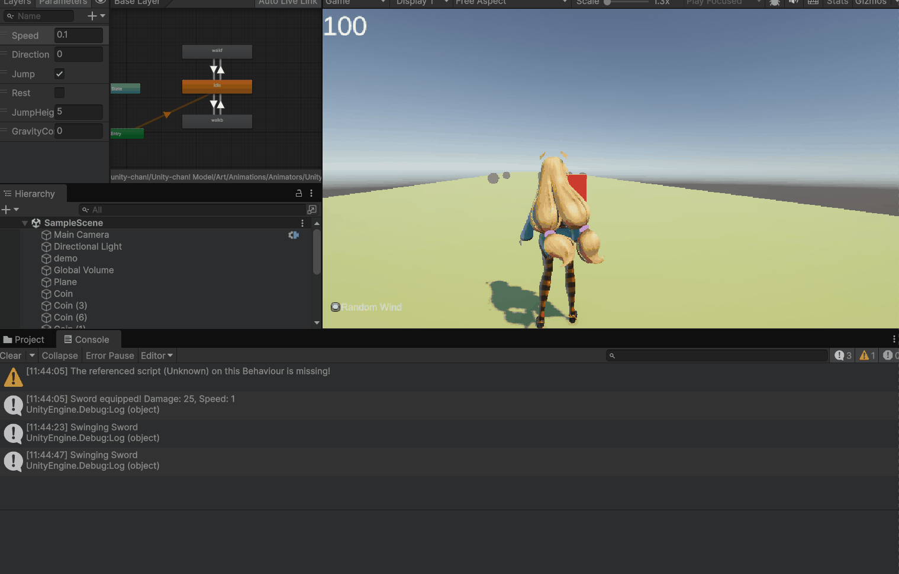
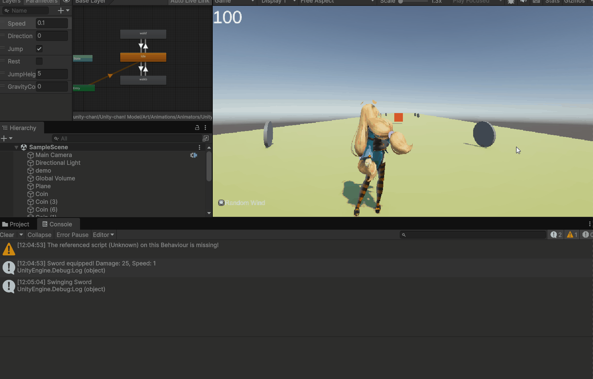
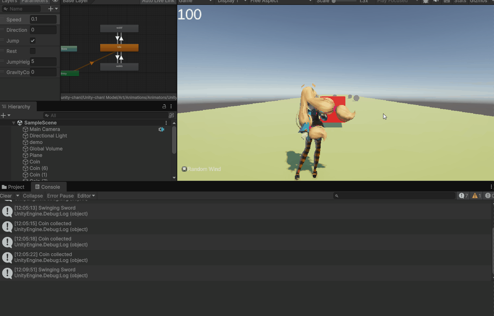

# Mijn Game Project

Welkom bij mijn game project! Dit is een kleine demonstratie van wat ik heb gemaakt met Unity.  

## Features

In deze game zijn de volgende functionaliteiten geïmplementeerd:

- **Healthbar** – Je kunt de HP van de speler zien en deze neemt af wanneer je damage neemt.  
- **Character Movement** – Je kunt je karakter bewegen met [WASD].  
- **Cinemachine** – Voor volgende camera.
- **Muntjes** – Verzamel munten om je score te verhogen.  
- **Enemy** – Vijanden die damage doen tegen de speler. 
- **Meerdere Wapens** – Wissel tussen verschillende wapens. Ik heb switch hiervoor gebruikt.

## Opdracht 2!
### Een draaiend muntje die je op pakt!

## Opdracht 3!
### Vallende bal die stuitert!

## Opdracht 4!
### Enemy waarbij HP eraf gaat door een trigger!

